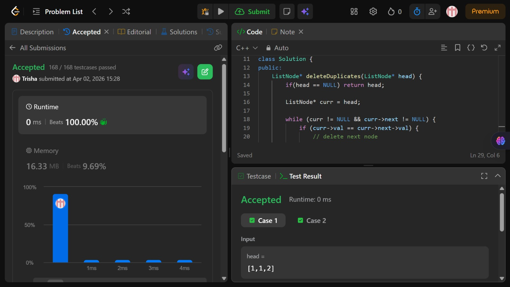

# Problem of the Day - Day 12

## Problem Name:
Remove Duplicates from Sorted List

## Problem Link:
https://leetcode.com/problems/remove-duplicates-from-sorted-list/description/

## Approach:

1. Since the linked list is sorted, duplicate elements will be adjacent
2. Initialize a pointer curr to the head of the list
3. Traverse the list while curr and curr->next are not NULL
4. At each step, compare:
    * If curr->val == curr->next->val
        → duplicate node found
        → delete the next node by updating:
            curr->next = curr->next->next
    * Else
        → move curr forward to next node
            curr = curr->next
5. Continue this process until the end of the list
6. Return the head of the modified list

## Code:
```cpp
class Solution {
public:
    ListNode* deleteDuplicates(ListNode* head) {
        if(head == NULL) return head;

        ListNode* curr = head;

        while (curr != NULL && curr->next != NULL) {
            if (curr->val == curr->next->val) {
                // delete next node
                curr->next = curr->next->next;
            } else {
                curr = curr->next;
            }
        }

        return head;

    }
};
```
## Screenshot of Accepted Solution:


## Complexity:

* Time Complexity: O(n)
* Space Complexity: O(1)
