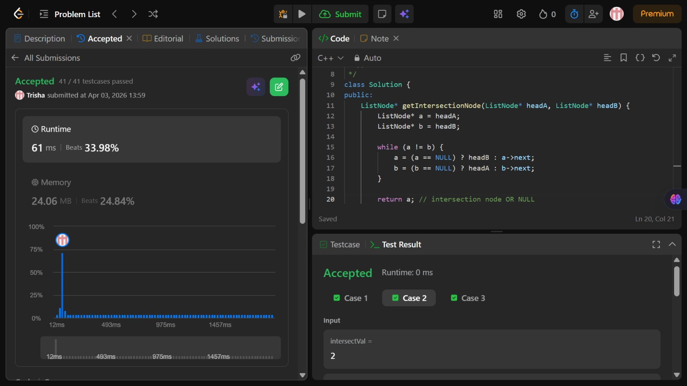

# Problem of the Day - Day 13

## Problem Name:
Intersection of Two Linked Lists

## Problem Link:
https://leetcode.com/problems/intersection-of-two-linked-lists/description/

## Approach:

1. Use two pointers a and b starting from headA and headB
2. Traverse both lists simultaneously
3. When a pointer reaches NULL, redirect it to the head of the other list
4. Continue until both pointers meet

## Code:
```cpp
class Solution {
public:
    ListNode* getIntersectionNode(ListNode* headA, ListNode* headB) {
        ListNode* a = headA;
        ListNode* b = headB;

        while (a != b) {
            a = (a == NULL) ? headB : a->next;
            b = (b == NULL) ? headA : b->next;
        }

        return a; // intersection node OR NULL
    }
};
```
## Screenshot of Accepted Solution:


## Complexity:

* Time Complexity: O(n+m)
* Space Complexity: O(1)
