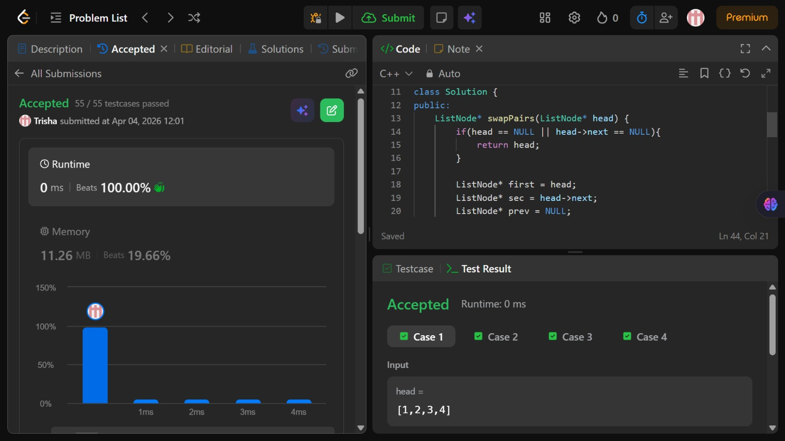

# Problem of the Day - Day 14

## Problem Name:
Swap Nodes in Pairs

## Problem Link:
https://leetcode.com/problems/swap-nodes-in-pairs/description/

## Approach:

1. Handle edge cases
    * If the list is empty or has only one node, return head (no swap needed).
2. Initialize pointers
    * first → points to first node of the pair
    * sec → points to second node of the pair
    * prev → keeps track of the last node of the previous swapped pair (initially NULL)
3. Traverse the list in pairs
    * Run a loop while both first and sec are not NULL.
4. Store next pair
    * Save sec->next in a pointer third (start of next pair).
5. Swap the current pair
    * Point sec->next to first
    * Point first->next to third
6. Connect with previous part
    * If prev is not NULL, connect prev->next to sec
    * Else, update head = sec (new head after first swap)
7. Move pointers forward
    * Update prev = first (tail of current swapped pair)
    * Move first = third (start of next pair)
    * Update sec accordingly:
        * If third != NULL, sec = third->next
        * Else, sec = NULL
8. Return the updated head

## Code:
```cpp
/**
 * Definition for singly-linked list.
 * struct ListNode {
 *     int val;
 *     ListNode *next;
 *     ListNode() : val(0), next(nullptr) {}
 *     ListNode(int x) : val(x), next(nullptr) {}
 *     ListNode(int x, ListNode *next) : val(x), next(next) {}
 * };
 */
class Solution {
public:
    ListNode* swapPairs(ListNode* head) {
        if(head == NULL || head->next == NULL){
            return head;
        }

        ListNode* first = head;
        ListNode* sec = head->next;
        ListNode* prev = NULL;

        while(first != NULL && sec != NULL){
            ListNode* third = sec->next;

            sec->next = first;
            first->next = third;

            if(prev != NULL){
                prev->next = sec;
            } else {
                head = sec;
            }

            //updation for next iteration
            prev = first;
            first = third;
            if(third != NULL){
                sec = third->next;
            } else {
                sec = NULL;
            }
        }

        return head;
    }
};
```
## Screenshot of Accepted Solution:


## Complexity:

* Time Complexity: O(n)
* Space Complexity: O(1)
