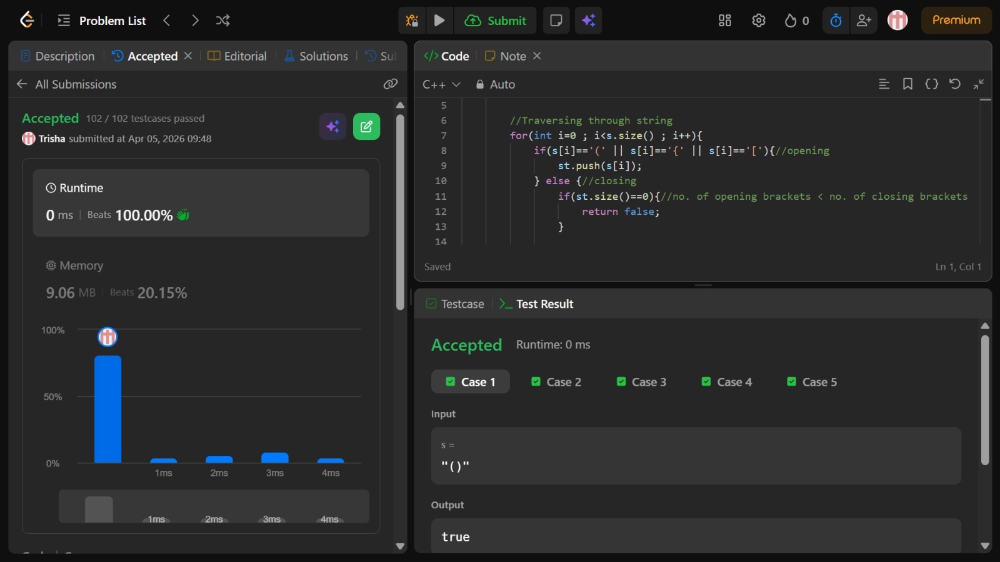

# Problem of the Day - Day 15

## Problem Name:
Valid Parenthesis 

## Problem Link:
https://leetcode.com/problems/valid-parentheses/

## Approach:
1. Initialize a Stack
    * Create a stack st to store opening brackets.
2. Traverse the String
    * Iterate through each character of the string.
3. If Opening Bracket
    * If current character is '(', '{', or '['
        → Push it into the stack.
3. If Closing Bracket
    * First check:
        * If stack is empty → no matching opening bracket
            → Return false
4. Check for Matching Pair
    * Compare top of stack with current closing bracket:
        * '(' → ')'
        * '{' → '}'
        * '[' → ']'
    * If matched → pop from stack
    * Else → return false (invalid sequence)
6. After Traversal
    * If stack is empty → all brackets matched
        → Return true
    * Else → extra opening brackets remain
        → Return false

## Code:
```cpp
class Solution {
public:
    bool isValid(string s) {
        stack<char> st;

        //Traversing through string
        for(int i=0 ; i<s.size() ; i++){
            if(s[i]=='(' || s[i]=='{' || s[i]=='['){//opening
                st.push(s[i]);
            } else {//closing
                if(st.size()==0){//no. of opening brackets < no. of closing brackets
                    return false;
                }

                if((st.top()=='(' && s[i]==')')|| 
                (st.top()=='{' && s[i]=='}')||
                (st.top()=='[' && s[i]==']')){
                    st.pop();
                } else { //no match
                    return false;
                }

            }
        }
        return st.size()==0; //no. of opening brackets > no. of closing brackets
    }
};
```
## Screenshot of Accepted Solution:


## Complexity:

* Time Complexity: O(n)
* Space Complexity: O(n) (in worst case, all opening brackets)
