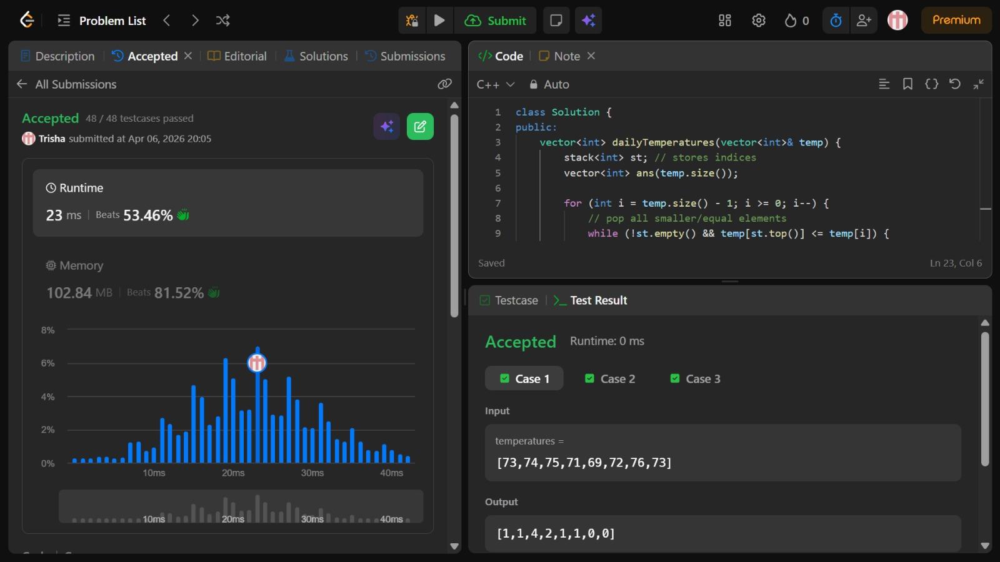

# Problem of the Day - Day 16

## Problem Name:
Daily Temperatures

## Problem Link:
https://leetcode.com/problems/daily-temperatures/description/

## Approach:
1. Initialize:
    * Create an empty stack st (to store indices).
    * Create a result vector ans of same size, initialized with 0.

2. Traverse from Right to Left:
    * Start from the last index and move towards the first.
    * This helps us find the next warmer day (future element).

3. Maintain Monotonic Stack:
    * For each index i, compare temp[i] with elements in stack:
    * While stack is not empty and:
        temp[st.top()] <= temp[i]
        → Pop the stack
    * Reason:
        These elements can never be the next warmer day for current or previous indices.

4. Find Answer for Current Index:
    * If stack becomes empty:
        * No warmer temperature exists in future
            → ans[i] = 0
            
    * Else:
        * Next warmer day is at index st.top()
        * → ans[i] = st.top() - i

5. Push Current Index:
    * Push i into the stack (so it can act as a candidate for previous elements)

6. Repeat:
    * Continue this process for all indices.
    
7. Return Result:
    * Return the ans array.

## Code:
```cpp
class Solution {
public:
    vector<int> dailyTemperatures(vector<int>& temp) {
        stack<int> st; // stores indices
        vector<int> ans(temp.size());

        for (int i = temp.size() - 1; i >= 0; i--) {
            // pop all smaller/equal elements
            while (!st.empty() && temp[st.top()] <= temp[i]) {
                st.pop();
            }

            // if empty → no greater on right
            if (st.empty())
                ans[i] = 0;
            else
                ans[i] = st.top() - i;

            st.push(i);
        }

        return ans;
    }
};
```
## Screenshot of Accepted Solution:


## Complexity:

* Time Complexity: O(n) (each element is processed once)
* Space Complexity: O(n) (stack + result array)
