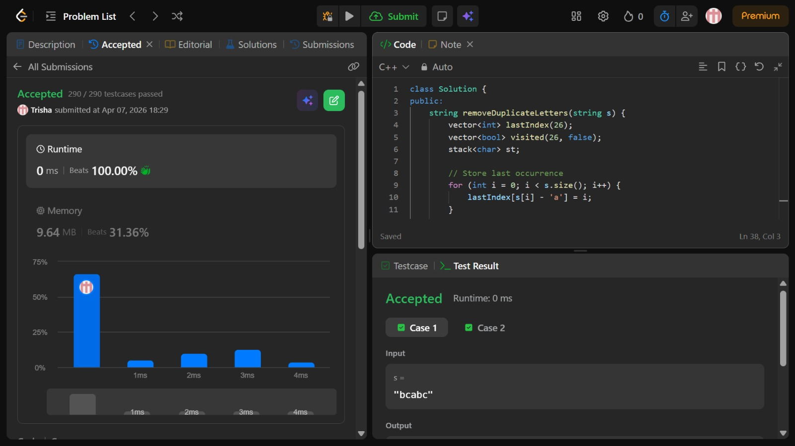

# Problem of the Day - Day 17

## Problem Name:
Remove Duplicates Letters

## Problem Link:
https://leetcode.com/problems/remove-duplicate-letters/description/

## Approach:
1. Maintain:
    * stack → to build result
    * visited → to avoid duplicates
    * lastIndex → last occurrence of each character
2. Traverse the String
    * If character already in stack → skip
3. Otherwise:
    * While:
        * stack not empty
        * current char < top of stack
        * AND top appears later again → POP the stack
4. Push current character into stack
5. Mark it visited
6. At the end → stack = answer

## Code:
```cpp
class Solution {
public:
    string removeDuplicateLetters(string s) {
        vector<int> lastIndex(26);
        vector<bool> visited(26, false);
        stack<char> st;

        // Store last occurrence
        for (int i = 0; i < s.size(); i++) {
            lastIndex[s[i] - 'a'] = i;
        }

        for (int i = 0; i < s.size(); i++) {
            char ch = s[i];

            if (visited[ch - 'a'])
                continue;

            while (!st.empty() && st.top() > ch &&
                   lastIndex[st.top() - 'a'] > i) {
                visited[st.top() - 'a'] = false;
                st.pop();
            }

            st.push(ch);
            visited[ch - 'a'] = true;
        }

        string ans = "";
        while (!st.empty()) {
            ans += st.top();
            st.pop();
        }

        reverse(ans.begin(), ans.end());
        return ans;
    }
};
```
## Screenshot of Accepted Solution:


## Complexity:

* Time Complexity: O(n)
* Space Complexity: O(n)