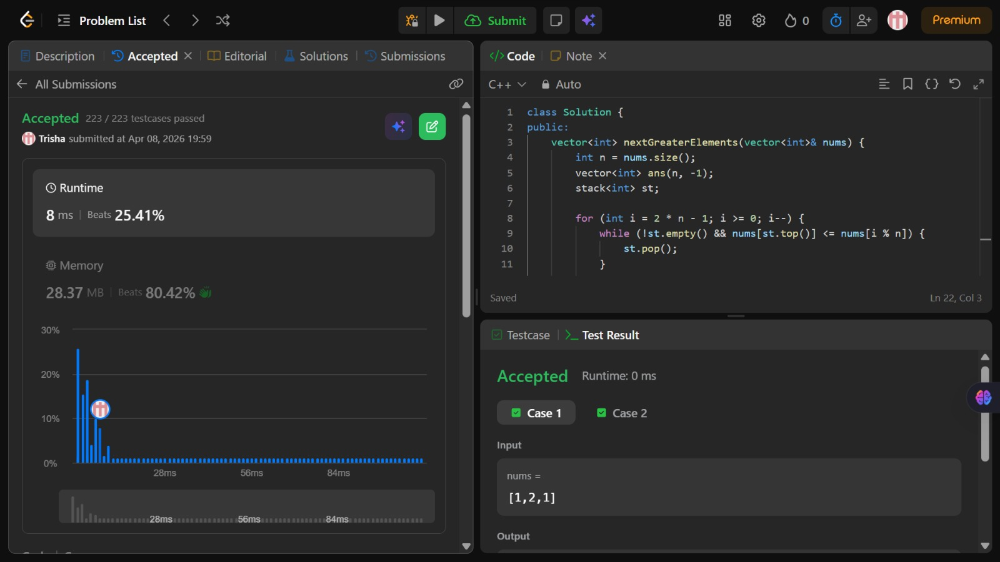

# Problem of the Day - Day 18

## Problem Name:
Next Greater Element II

## Problem Link:
https://leetcode.com/problems/next-greater-element-ii/description/

## Approach:
1. Initialize:
    * Stack st (to store indices)
    * Answer array ans filled with -1
2. Traverse from 2n - 1 → 0 (reverse)
    * Use i % n to handle circular indexing
3. While stack is not empty AND
    nums[st.top()] <= nums[i % n]
    → pop
4. If stack not empty:
    * ans[i % n] = nums[st.top()]
5. Push current index (i % n) into stack

## Code:
```cpp
class Solution {
public:
    vector<int> nextGreaterElements(vector<int>& nums) {
        int n = nums.size();
        vector<int> ans(n, -1);
        stack<int> st;

        for (int i = 2 * n - 1; i >= 0; i--) {
            while (!st.empty() && nums[st.top()] <= nums[i % n]) {
                st.pop();
            }

            if (!st.empty()) {
                ans[i % n] = nums[st.top()];
            }

            st.push(i % n);
        }

        return ans;
    }
};
```
## Screenshot of Accepted Solution:


## Complexity:

* Time Complexity: O(n) (each element pushed & popped once)
* Space Complexity: O(n)