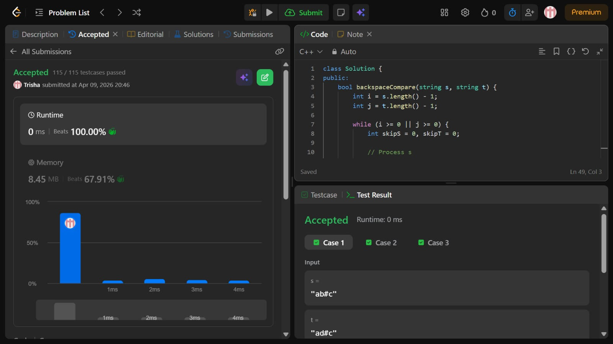

# Problem of the Day - Day 19

## Problem Name:
Backspace String Compare

## Problem Link:
https://leetcode.com/problems/backspace-string-compare/description/

## Approach:
1. Initialize two pointers:
    * i = s.length - 1
    * j = t.length - 1
2. Traverse both strings from right to left
3. For each string:
    * Maintain skipS and skipT
    * While:
    - If current char is '#', increment skip and move left
    - Else if skip > 0, decrement skip and move left
4. Compare valid characters:
    * If both valid chars exist and are different → return false
5. Move pointers and repeat
6. If all match → return true

## Code:
```cpp
class Solution {
public:
    bool backspaceCompare(string s, string t) {
        int i = s.length() - 1;
        int j = t.length() - 1;

        while (i >= 0 || j >= 0) {
            int skipS = 0, skipT = 0;

            // Process s
            while (i >= 0) {
                if (s[i] == '#') {
                    skipS++;
                    i--;
                } else if (skipS > 0) {
                    skipS--;
                    i--;
                } else break;
            }

            // Process t
            while (j >= 0) {
                if (t[j] == '#') {
                    skipT++;
                    j--;
                } else if (skipT > 0) {
                    skipT--;
                    j--;
                } else break;
            }

            // Compare characters
            if (i >= 0 && j >= 0) {
                if (s[i] != t[j]) return false;
            } else {
                if (i >= 0 || j >= 0) return false;
            }

            i--; 
            j--;
        }

        return true;
    }
};
```
## Screenshot of Accepted Solution:


## Complexity:

* Time Complexity: O(n + m) where n and m are lengths of s and t
* Space Complexity: O(1) (only pointers and counters used)