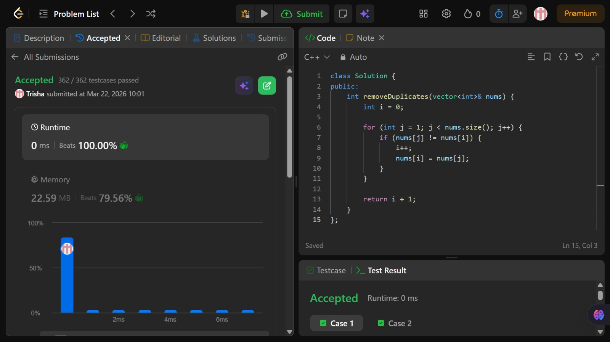

# Problem of the Day - Day 1

## Problem Name:
Remove Duplicates from Sorted Array

## Problem Link:
https://leetcode.com/problems/remove-duplicates-from-sorted-array/description/

## Approach:
1. Initialize pointer i to track the last unique element (start at 0).
2. Traverse the array with pointer j from 1 to end.
3. For each nums[j], compare it with nums[i].
4. If it’s different, increment i and overwrite nums[i] with nums[j].
5. After traversal, the first i + 1 elements are unique, so return i + 1.

## Code:
```cpp
class Solution {
public:
    int removeDuplicates(vector<int>& nums) {
        int i = 0;

        for (int j = 1; j < nums.size(); j++) {
            if (nums[j] != nums[i]) {
                i++;
                nums[i] = nums[j];
            }
        }

        return i + 1;
    }
};
```
## Screenshot of Accepted Solution:


## Complexity:
- Time Complexity: O(n)
- Space Complexity: O(1)
