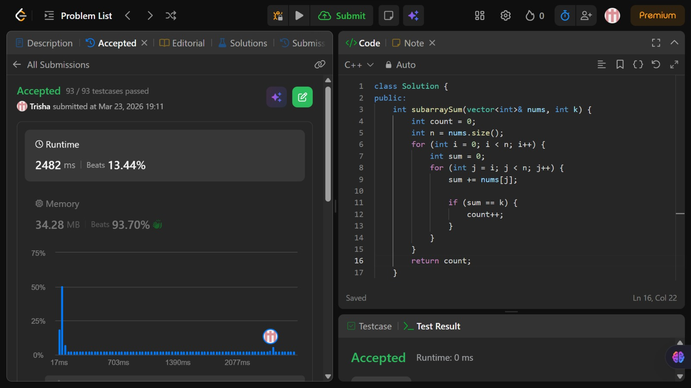

# Problem of the Day - Day 2

## Problem Name:
Subarray Sum Equals K

## Problem Link:
https://leetcode.com/problems/subarray-sum-equals-k/description/

## Approach:
1. Iterate over all possible starting indices of the array
2. For each index, extend the subarray using a second loop
3. Maintain a running sum to avoid recalculating subarray sums
4. If the running sum equals k, increment the count
5. Continue until all subarrays are checked

## Code:
```cpp
class Solution {
public:
    int subarraySum(vector<int>& nums, int k) {
        int count = 0;
        int n = nums.size();
        for (int i = 0; i < n; i++) {
            int sum = 0;
            for (int j = i; j < n; j++) {
                sum += nums[j];

                if (sum == k) {
                    count++;
                }
            }
        }
        return count;
    }
};
```
## Screenshot of Accepted Solution:


## Complexity:
- Time Complexity: O(n^2)
- Space Complexity: O(1)
