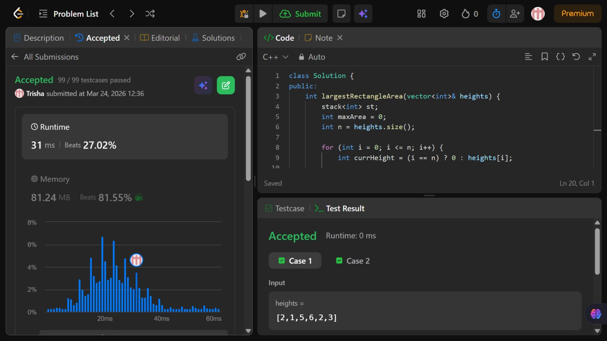

# Problem of the Day - Day 3

## Problem Name:
Largest Rectangle in Histogram

## Problem Link:
https://leetcode.com/problems/largest-rectangle-in-histogram/description/

## Approach:

1. Use a **monotonic increasing stack** to store indices of bars.
2. Traverse from `i = 0` to `n` (take height = `0` at `i = n` to flush stack).
3. If current height ≥ height at stack top → **push index**.
4. If current height < height at stack top → **pop elements** until stack is valid.
5. While popping:

  * Height = popped bar
  * Right boundary = current index `i`
  * Left boundary = new stack top (or `-1` if empty)
  * Width = `right - left - 1`
  * Area = `height × width` → update maximum
6. Continue till traversal ends.

## Code:
```cpp
class Solution {
public:
    int largestRectangleArea(vector<int>& heights) {
        stack<int> st;
        int maxArea = 0;
        int n = heights.size();

        for (int i = 0; i <= n; i++) {
            int currHeight = (i == n) ? 0 : heights[i];

            while (!st.empty() && currHeight < heights[st.top()]) {
                int h = heights[st.top()];
                st.pop();

                int left = st.empty() ? -1 : st.top();
                int width = i - left - 1;

                maxArea = max(maxArea, h * width);
            }

            st.push(i);
        }

        return maxArea;
    }
};
```
## Screenshot of Accepted Solution:


## Complexity:
* Time Complexity: O(n)
* Space Complexity: O(n)
