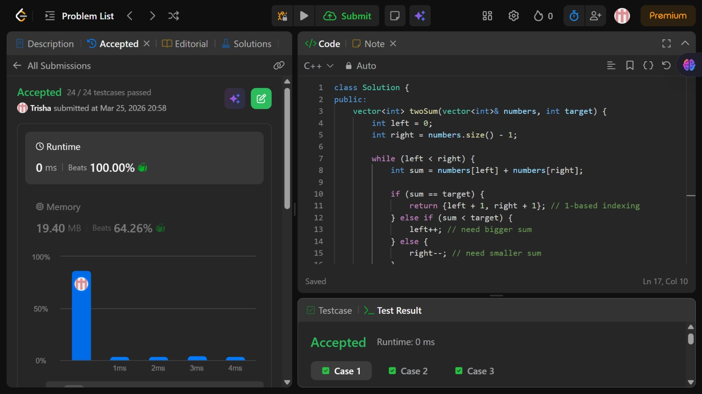

# Problem of the Day - Day 4

## Problem Name:
Two Sum II - Input array is sorted

## Problem Link:
https://leetcode.com/problems/two-sum-ii-input-array-is-sorted/description/

## Approach:

1. The given array is sorted, so we can use this property to find the pair efficiently.
2. We initialize two pointers:
*  left at the beginning (index 0)
* right at the end (index n - 1)
3. At each step, we calculate the sum:
* sum = numbers[left] + numbers[right]
4. Then we compare the sum with the target:
* If sum == target, we return the indices (1-based).
* If sum < target, we move left forward to increase the sum.
* If sum > target, we move right backward to decrease the sum.
5. We repeat this process until the required pair is found.

## Code:
```cpp
class Solution {
public:
    vector<int> twoSum(vector<int>& numbers, int target) {
        int left = 0;
        int right = numbers.size() - 1;

        while (left < right) {
            int sum = numbers[left] + numbers[right];

            if (sum == target) {
                return {left + 1, right + 1}; // 1-based indexing
            } else if (sum < target) {
                left++; // need bigger sum
            } else {
                right--; // need smaller sum
            }
        }

        return {}; // just in case (problem guarantees one solution)
    }
};
```
## Screenshot of Accepted Solution:


## Complexity:
* Time Complexity: O(n)
* Space Complexity: O(1)
