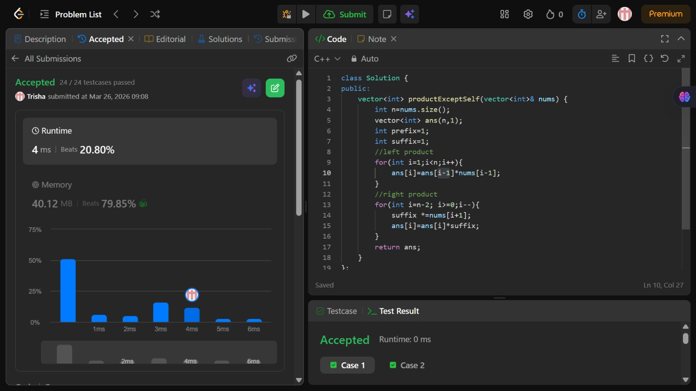

# Problem of the Day - Day 5

## Problem Name:
Product of Array Except Self

## Problem Link:
https://leetcode.com/problems/product-of-array-except-self/description/

## Approach:

1. For every index, we need product of all elements except itself
2. Instead of dividing, we:
    * multiply numbers on the left
    * multiply numbers on the right
3. First pass (left side):
    * store product of elements before each index
4. Second pass (right side):
    * multiply with product of elements after each index
5. Use a variable (right) to track right product while going backwards
6. Final array gives the answer

## Code:
```cpp
class Solution {
public:
    vector<int> productExceptSelf(vector<int>& nums) {
        int n=nums.size();
        vector<int> ans(n,1);
        int prefix=1;
        int suffix=1;
        //left product
        for(int i=1;i<n;i++){
            ans[i]=ans[i-1]*nums[i-1];
        }
        //right product
        for(int i=n-2; i>=0;i--){
            suffix *=nums[i+1];
            ans[i]=ans[i]*suffix;
        }
        return ans;
    }
};
```
## Screenshot of Accepted Solution:


## Complexity:
* Time Complexity: O(n)
* Space Complexity: O(1)
