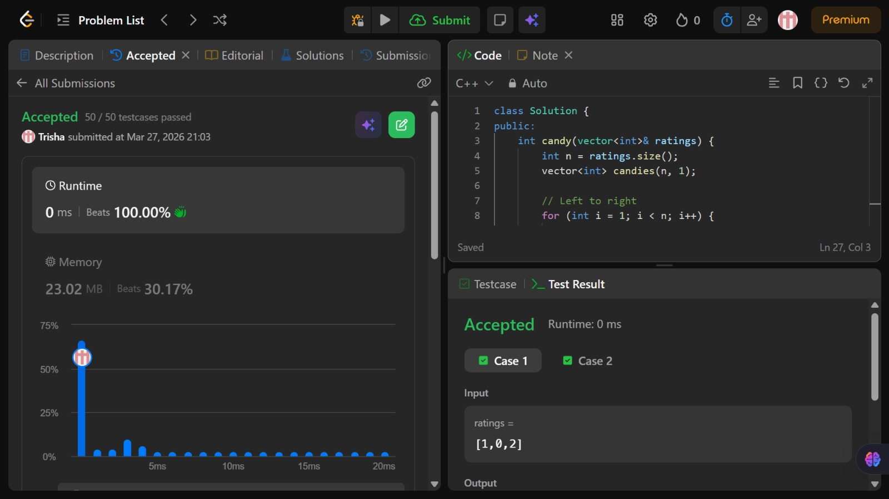

# Problem of the Day - Day 6

## Problem Name:
Candy

## Problem Link:
https://leetcode.com/problems/candy/description/

## Approach:

1. Assign 1 candy to each child initially
2. Traverse left to right:
    * If ratings[i] > ratings[i-1] → assign candies[i] = candies[i-1] + 1
3. Traverse right to left:
    * If ratings[i] > ratings[i+1] → update
    * candies[i] = max(candies[i], candies[i+1] + 1)
4. This ensures both left and right conditions are satisfied
5. Finally, sum all candies to get the minimum required

## Code:
```cpp
class Solution {
public:
    int candy(vector<int>& ratings) {
        int n = ratings.size();
        vector<int> candies(n, 1);

        // Left to right
        for (int i = 1; i < n; i++) {
            if (ratings[i] > ratings[i - 1]) {
                candies[i] = candies[i - 1] + 1;
            }
        }

        // Right to left
        for (int i = n - 2; i >= 0; i--) {
            if (ratings[i] > ratings[i + 1]) {
                candies[i] = max(candies[i], candies[i + 1] + 1);
            }
        }

        int sum = 0;
        for (int c : candies)
            sum += c;

        return sum;
    }
};
```
## Screenshot of Accepted Solution:


## Complexity:
* Time Complexity: O(n)
* Space Complexity: O(n)
