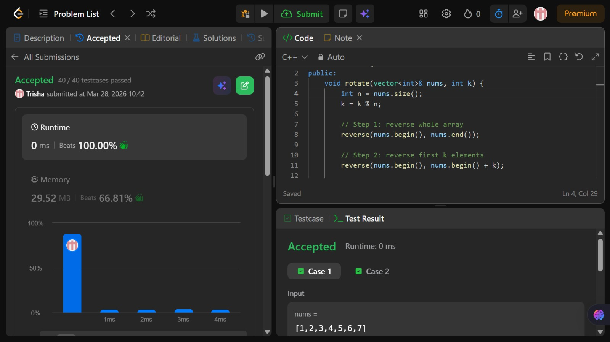

# Problem of the Day - Day 7

## Problem Name:
Rotate Array

## Problem Link:
https://leetcode.com/problems/rotate-array/description/

## Approach:

1. Take array size n and compute:
    * k = k % n;
to avoid unnecessary full rotations.
2. Reverse the entire array
    → this brings last k elements to the front (but in reverse order)
3. Reverse the first k elements
    → restores correct order of rotated part
4. Reverse the remaining (n - k) elements
    → restores correct order of remaining elements

## Code:
```cpp
class Solution {
public:
    void rotate(vector<int>& nums, int k) {
        int n = nums.size();
        k = k % n;

        // Step 1: reverse whole array
        reverse(nums.begin(), nums.end());

        // Step 2: reverse first k elements
        reverse(nums.begin(), nums.begin() + k);

        // Step 3: reverse remaining elements
        reverse(nums.begin() + k, nums.end());
    }
};
```
## Screenshot of Accepted Solution:


## Complexity:
* Time Complexity: O(n)
* Space Complexity: O(1)
