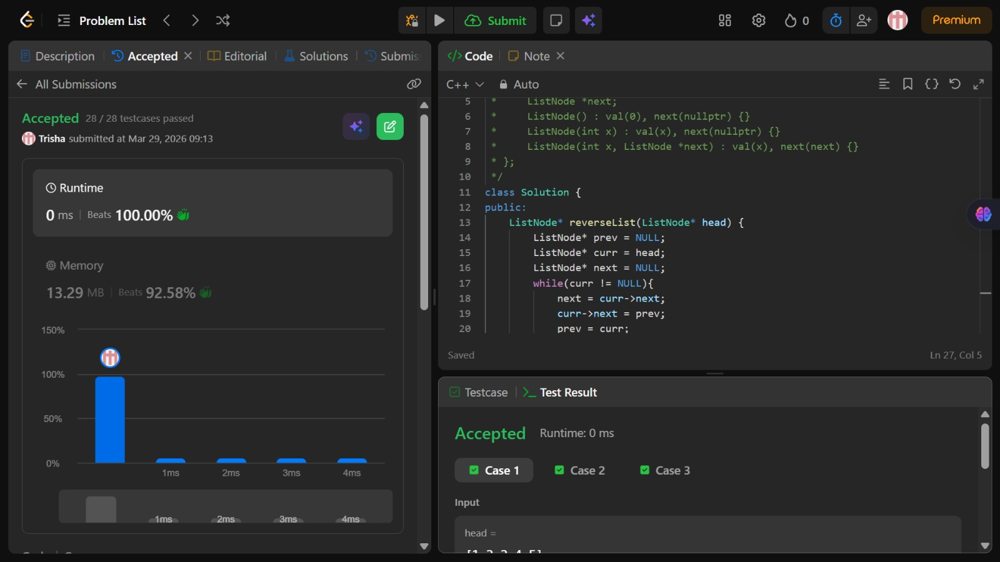

# Problem of the Day - Day 8

## Problem Name:
Reverse Linked List

## Problem Link:
https://leetcode.com/problems/reverse-linked-list/

## Approach:

1. Initialize three pointers:
    * prev = NULL → will store the previous node
    * curr = head → starts from the head of the list
    * next = NULL → to temporarily store the next node
2. Traverse the linked list:
    * Loop while curr != NULL
3. Store next node:
    * next = curr->next
    (Save next node before breaking the link)
4. Reverse the link:
    * curr->next = prev
    (Make current node point to previous)
5. Move pointers forward:
    * prev = curr
    * curr = next
6. Repeat until end of list
7. Return new head:
    * prev will be the new head of reversed list

## Code:
```cpp
class Solution {
public:
    ListNode* reverseList(ListNode* head) {
        ListNode* prev = NULL;
        ListNode* curr = head;
        ListNode* next = NULL;
        while(curr != NULL){
            next = curr->next;
            curr->next = prev;
            prev = curr;
            curr = next;
        }

        return prev;
        
    }
};  
```
## Screenshot of Accepted Solution:


## Complexity:
* Time Complexity: O(n)
* Space Complexity: O(1)
