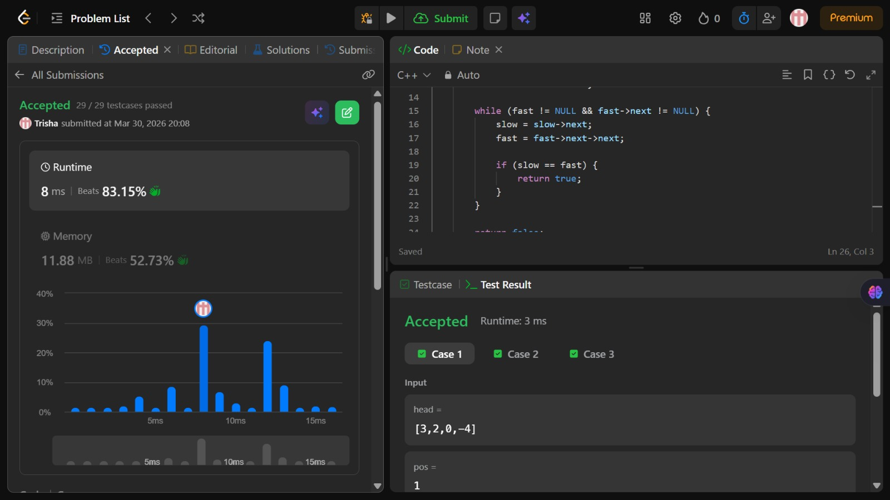

# Problem of the Day - Day 9

## Problem Name:
Linked List Cycle

## Problem Link:
https://leetcode.com/problems/linked-list-cycle/description/

## Approach:

1. Initialize two pointers:
    * slow = head
    * fast = head
2. Traverse the list:
3. Move slow by 1 step → slow = slow->next
4. Move fast by 2 steps → fast = fast->next->next
5. Check condition:
6. If slow == fast → cycle exists 
7. Termination condition:
    * If fast == NULL OR fast->next == NULL → no cycle 

## Code:
```cpp
class Solution {
public:
    bool hasCycle(ListNode* head) {
        ListNode* slow = head;
        ListNode* fast = head;

        while (fast != NULL && fast->next != NULL) {
            slow = slow->next;
            fast = fast->next->next;

            if (slow == fast) {
                return true;
            }
        }

        return false;
    }
};
```
## Screenshot of Accepted Solution:


## Complexity:
* Time Complexity: O(n)
* Space Complexity: O(1)
