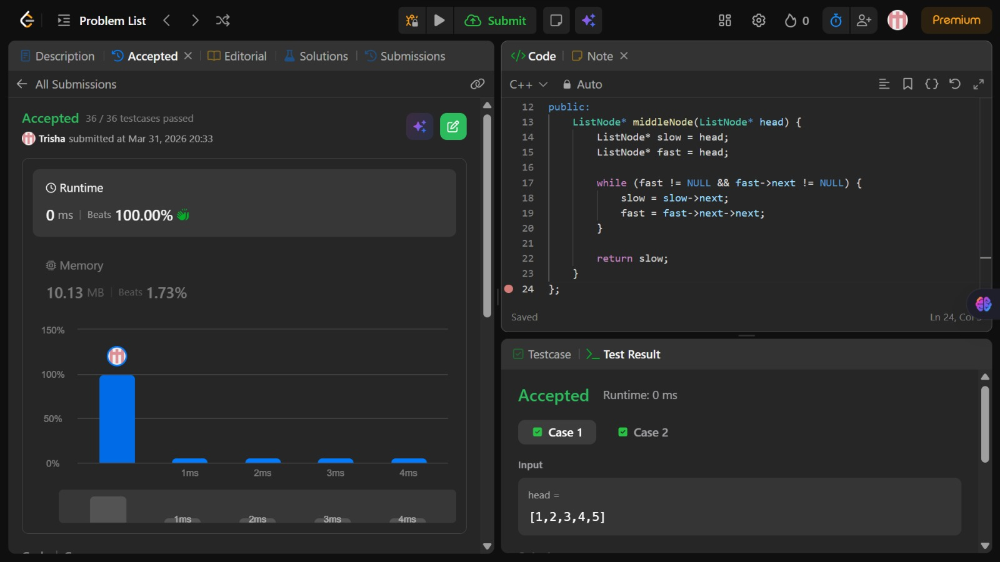

# Problem of the Day - Day 10

## Problem Name:
Middle of the Linked List

## Problem Link:
https://leetcode.com/problems/middle-of-the-linked-list/description/

## Approach:

1. Use two pointers: slow (1 step) and fast (2 steps)
2. Initialize both at head
3. Move:
    * slow = slow->next
    * fast = fast->next->next
3. Stop when fast == NULL or fast->next == NULL
4. Return slow 

## Code:
```cpp
class Solution {
public:
    ListNode* middleNode(ListNode* head) {
        ListNode* slow = head;
        ListNode* fast = head;

        while (fast != NULL && fast->next != NULL) {
            slow = slow->next;
            fast = fast->next->next;
        }

        return slow;
    }
};
```
## Screenshot of Accepted Solution:


## Complexity:
* Time Complexity: O(n)
* Space Complexity: O(1)
